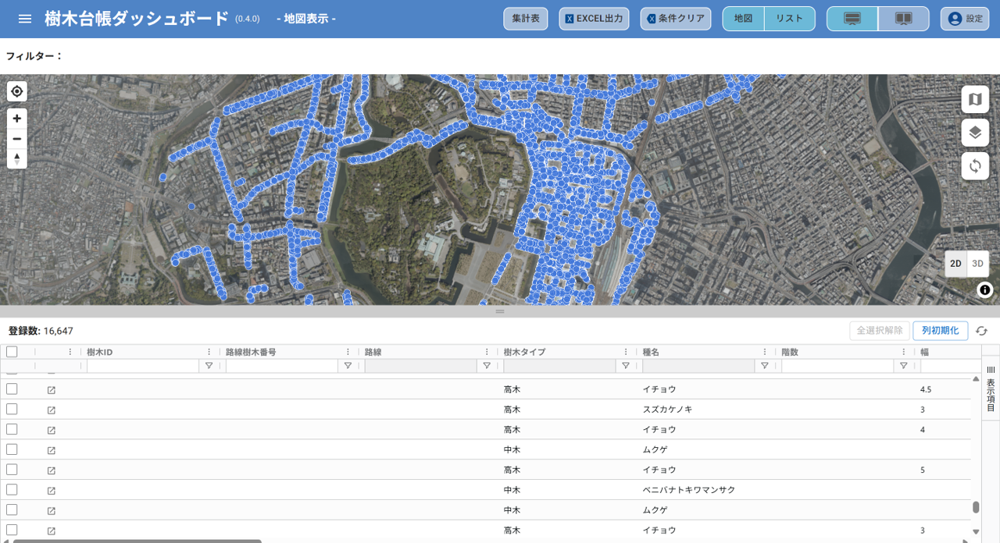

# 樹木管理ダッシュボード

## 更新履歴
| 更新日時     | リリース       | 更新内容                                       |
|-------------|--------------|----------------------------------------------|
| 2026/3/**  | 1st Release  | 初版リリース |

## 1. 概要 
本リポジトリでは、2025年度のProject PLATEAUで開発した「樹木管理ダッシュボード」のソースコードを公開しています。

本システムは、3D都市モデルを活用した樹木管理機能及び緑の効果の定量的評価を支援する取り組みである「樹木データを活用した温熱環境シミュレータの開発」の一部として開発されたWebアプリケーションです。

## 2. 「樹木管理ダッシュボード」について 
「樹木管理ダッシュボード」は、樹木管理台帳システムです。地方公共団体や民間企業等がこれまで紙やPDFなどで管理し、形式や所在が統一されていなかった緑地関連データを、一元的にデータベースで管理する機能を整備することで、効率的な樹木管理を実現することを目的としています。

本システムの詳細については[技術検証レポート](https://www.mlit.go.jp/plateau/file/libraries/doc/*****)を参照してください。

## 3. 利用手順 
本システムの構築手順及び利用手順については[利用チュートリアル](https://project-plateau.github.io/green-dashboard)を参照してください。

## 4. システム概要
### 【樹木管理台帳】
#### ①樹木台帳（地図・リスト表示）
- 樹木台帳データベースに登録されている樹木データを地図上およびリストで表示します
- 樹木ごとの詳細情報を個票で表示します

#### ②検索・絞り込み、エクスポート
- リストから条件（樹種・樹高など）を絞り込みで表示します。絞り込みと地図上の樹木ポイントが連動します
- 絞り込んだ結果は、Excel形式でダウンロードできます。

#### ③集計表、エクスポート　
- 予め設定した条件に応じて自動集計した結果を表示します
- 集計した結果は、、Excel形式でダウンロードできます。

### 【文書管理】
#### ①文書管理（リスト表示）
- 3D都市モデルやPDF等の関連データの登録、検索、リストを表示します。

## 5. 利用技術

| 種別            | 名称                                                     | バージョン          | 内容                                      |
| ------------- | ------------------------------------------------------ | -------------- | --------------------------------------- |
| オープンソースソフトウェア | [Apache HTTP Server](https://httpd.apache.org/)        | 2.4.58         | Webアプリで配信を行うためのWebサーバーソフトウェア            |
|               | [PostGIS](https://github.com/postgis/postgis)          | 3.4.1          | PostgreSQLで位置情報を扱うことを可能とする拡張機能          |
| オープンソースライブラリ  | [CesiumJS](https://github.com/CesiumGS/cesium)         | 1.115          | 3Dビューワ上にデータを描画するためのライブラリ                |
|               | [React.js](https://github.com/facebook/react/releases) | 18.2.0         | JavaScriptのフレームワーク内で機能するUIを構築するためのライブラリ |
| オープンソースRDBMS  | [PostgreSQL](https://github.com/postgres/postgres)     | 16.2           | 各種配信するデータを格納するリレーショナルデータベース             |
| 商用ソフトウェア      | [FME Form](https://safe.com/)                          | 2025.1, 2025.2 | ファイル変換などの処理およびその自動化を行う                  |
|               | [Cesium ion](https://cesium.com/platform/cesium-ion/)  | -              | 3Dデータの変換と配信のクラウドサービス                    |
| 商用ライブラリ       | [AG Grid](https://ag-grid.com/)                        | 31.1.1         | JavaScriptで集計、フィルタリング等を行うためのライブラリ       |
| クラウドサービス      | [Firebase](https://firebase.google.com/)               | -              | 認証機能を提供するクラウドサービス         |

## 6. 動作環境 
| 項目               | 最小動作環境                                                                                                                                                                                                                                                                                                                                    | 推奨動作環境                   | 
| ------------------ | ----------------------------------------------------------------------------------------------------------------------------------------------------------------------------------------------------------------------------------------------------------------------------------------------------------------------------------------------- | ------------------------------ | 
| OS                 | Microsoft Windows 10 以上　または macOS 12 Monterey 以上                                                                                                                                                                                                                                                                                                                  |  同左 | 
| CPU                | Pentium 4 以上                                                                                                                                                                                                                                                                                                                               | 同左              | 
| メモリ             | 8GB以上                                                                                                                                                                                                                                                                                                                                         | 同左                        |                  | 

## 7. 本リポジトリのフォルダ構成 
| フォルダ名                              | 詳細                   |
| ---------------------------------- | -------------------- |
| img                                | スクリーンショット    |
| public                             | 公開用静的ファイル（favicon 等） |
| src/components                     | UI共通コンポーネント          |
| src/components/agGrid              | AG Grid関連UI          |
| src/components/agGrid/cellRenderer | グリッドセル描画処理           |
| src/manager                        | API通信・画像処理・ユーティリティ   |
| src/map                            | 地図表示関連モジュール          |
| src/map/cesiumLayer                | Cesium用3Dレイヤ処理       |
| src/map/layers                     | 地図レイヤ定義              |
| src/map/styles                     | 地図スタイル定義             |
| src/resources                      | 静的リソース               |
| src/resources/aggrid               | AG Grid設定・ローカライズ     |
| src/resources/fonts                | フォントファイル             |
| src/resources/img                  | UIアイコン・画像            |
| src/resources/map_style            | MapLibreスタイルJSON     |
| src/views                          | 画面UI                 |
| src/views/document                 | 文書管理画面               |
| src/views/header                   | ヘッダーUI               |
| src/views/main                     | メイン画面                |
| src/views/main/filter              | フィルタUI               |
| src/views/main/list                | 一覧表示UI               |
| src/views/main/map                 | 地図表示UI               |
| src/views/main/summary             | 集計表示UI               |
| src/views/main/treeInfo            | 樹木詳細UI               |
| src                                | アプリ本体ソース             |
| src/App.jsx                        | ルートコンポーネント           |
| src/main.jsx                       | エントリポイント             |
| src/main.css                       | 全体スタイル               |
| index.html                         | HTMLテンプレート           |
| package.json                       | 依存ライブラリ定義            |
| package-lock.json                  | 依存固定定義               |
| eslint.config.js                   | Lint設定               |                                | 
| workspaces  |  FME Form で実行するワークスペース                                                                                                                                                                                                                                                                                 | 

## 8. ライセンス

- ソースコード及び関連ドキュメントの著作権は国土交通省に帰属します。
- 本ドキュメントは[Project PLATEAUのサイトポリシー](https://www.mlit.go.jp/plateau/site-policy/)（CCBY4.0及び政府標準利用規約2.0）に従い提供されています。

## 9. 注意事項 

- 本リポジトリは参考資料として提供しているものです。動作保証は行っていません。
- 本リポジトリについては予告なく変更又は削除をする可能性があります。
- 本リポジトリの利用により生じた損失及び損害等について、国土交通省はいかなる責任も負わないものとします。

## 10. 参考資料
- 技術検証レポート: https://www.mlit.go.jp/plateau/file/libraries/doc/****.pdf
- PLATEAU WebサイトのUse caseページ「樹木データを活用した温熱環境シミュレータの開発」: https://www.mlit.go.jp/plateau/use-case/uc25-11/
