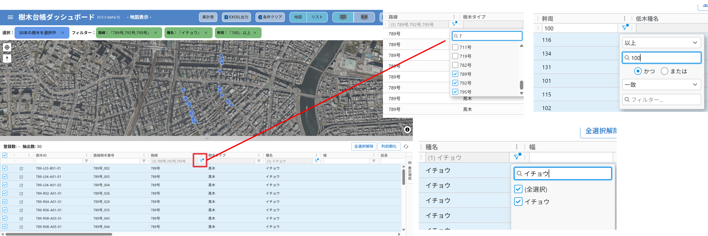
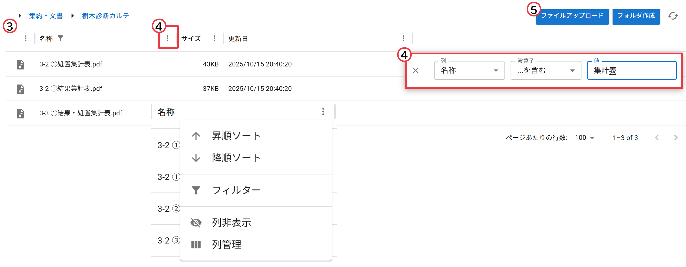

# 操作マニュアル

# 1 本書について

本書では、樹木管理ダッシュボード（以下「本システム」という。）の操作手順について記載しています。

# 2 使い方

## 2-1 ログイン画面

本システムをデプロイしたURLにアクセスすると以下の画面が表示されます。設定したログインID（メールアドレス）、パスワードを入力することでシステムのメイン（樹木管理）画面が表示されます。

## 2-2 メイン(樹木管理)画面

① 地図とリストの表示/非表示、上下/左右の設定

② 現在地表示、北を上にする

③ 背景地図切り替え、表示レイヤ切替

④ 検索、ソート、フィルタ

・リストの上部のウインドウで指定した条件により検索、ソートが可能です（複数条件を設定可）

⑤ 属性情報の絞り込み

・路線や幹周などの属性情報を絞り込んで集計します。

⑥ 集計表

・あらかじめ設定した条件に応じて自動集計します。

⑦ 集計表Excel出力

・集計結果を「Eｘcel出力」ボタンでエクスポートします。

⑧ 2D/3D地図表示

・2D/3D地図表示を切り替えます。

⑨ データエクスポート

・全ての行/フィルター適用/選択適用（リスト左端のチェックボックスで選択）をした樹木リストのデータをExcelでダウンロードします

## 2-3 文書管理画面

① 樹木管理/文書管理 画面切替

・右上のハンバーガーメニューにて、「樹木管理」「文書管理」を切り替えます

② フォルダアクセス

・フォルダアイコンから選択したフォルダにアクセスします

③ ファイルのリスト表示

・アップロードしたファイルのリストを作成し、表示します

④ ソート、検索

・各属性の「…」ボタンからソートや検索が可能です

⑤ ファイルアップロード

・ファイルアップロードボタンから、アップロードが可能です。

